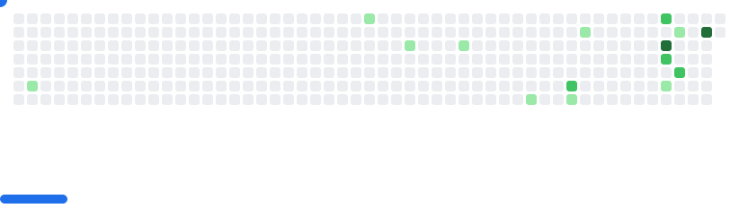
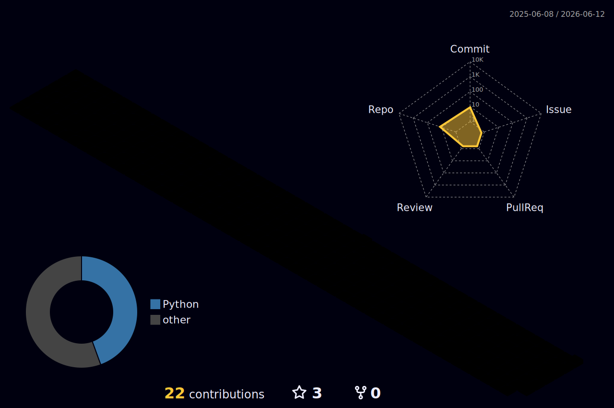

### 👋 Hi there, I'm Fu Kun

# This is my personal homepage.

  
  
  
  
  

  <a href="#-about">🧭 About</a> ·
  <a href="#-toolbox">🧰 Toolbox</a> ·
  <a href="#-featured-work">🚀 Featured Work</a> ·
  <a href="#-repositories">🏊 Repositories</a> ·
  <a href="#-stats">💻 Stats</a> ·
  <a href="#-contact">📮 Contact</a>

---

## 🤗 Welcome

> 这里是我的 GitHub 主页，也是我持续整理工程实践、AI 应用和学习轨迹的地方。希望每个项目都不只是“能跑”，而是能把真实问题拆清楚、把数据和模型接稳、把交互做顺。

  
  
  
  

## 🧭 About

我正在围绕 **AI 应用工程、后端服务、全栈协作、知识图谱与数据智能** 积累系统化能力。相比只做一个 demo，我更关注从数据处理、模型/大模型接入、API 设计、前端交互到上线部署的完整闭环。

- 🎓 武汉科技大学计算机科学与技术本科，GPA 3.33/4.0，专业前 10%。
- 🚀 2026-2029 中国地质大学（武汉）电子信息硕士研究生。
- 💼 武汉金山办公软件有限公司服务端开发实习，实践 Go 工程化、REST API、并发计算与 AI 应用集成。
- 🧠 项目兴趣集中在 GraphRAG、知识图谱、多模态 AI、时序预测、工程化后端与数据可视化。
- 🏆 获全国大学生数学竞赛国赛二等奖、全国大学生数学建模竞赛湖北赛区一等奖、MathorCup 华中赛区二等奖、蓝桥杯三等奖、鸿蒙应用设计比赛优秀奖等。

## 🧰 Toolbox

| 🔭 Direction         | 🛠️ Tools & Practices                                                                            |
| :------------------- | :---------------------------------------------------------------------------------------------- |
| 🤖 AI Applications   | Qwen, GLM, DeepSeek, Kimi, Prompt engineering, unified model service, fallback and retry.       |
| 🧱 Backend           | Go/Gin, Python/FastAPI, Java/Spring Boot, REST API, sqlx, SQLAlchemy, batch processing.         |
| 🕸️ Data Intelligence | Neo4j, GraphRAG, crawler pipelines, data cleaning, time-series forecasting, ECharts dashboards. |
| 🎨 Frontend          | React, Vite, Zustand, TypeScript, HarmonyOS ArkUI, responsive tool interfaces.                  |

**🧠 Backend & AI**

**🎛️ Frontend & Data**

## 🚀 Featured Work

### 🔬 [paper-search-mcp](https://github.com/223nobody/paper-search-mcp)

面向 AI Agent 的一站式学术论文 MCP 服务，支持多源检索、PDF 下载、MinerU 解析与出版商发行版获取。已发布为 Claude Code / Codex 可用的 MCP Server。

| 🧩 Area                | ✨ Highlights                                                                                      |
| :--------------------- | :------------------------------------------------------------------------------------------------- |
| 🔍 Multi-Source Search | 支持 arXiv、PubMed、Semantic Scholar、Crossref 等 21 个学术数据源，统一结果格式与跨源去重。        |
| 📥 Smart Download      | 开放获取优先的 PDF 下载策略，来源原生 → Unpaywall → OA 仓储多级回退，Sci-Hub 可选且默认关闭。      |
| 🧠 MinerU Parsing      | 集成 MinerU extract API，将 PDF 解析为 Markdown、结构化 JSON、图片/表格/公式等可复用资源。         |
| 🔌 MCP-First Design    | 50+ MCP 工具，自然语言驱动全流程；支持 MCP Apps checkbox 选择器、Elicitation 多选与编号 fallback。 |
| 🏢 Publisher PDF       | 通过 scansci-pdf MCP Chaining 自动获取 Nature、Elsevier、Springer 等出版商最终发行版 PDF。         |

**🧪 Stack:** Python, MCP (Model Context Protocol), MinerU, scansci-pdf, SQLite FTS, arXiv API, Semantic Scholar API, Crossref API, Playwright

### 🌪️ [TyphoonAnalysis](https://github.com/223nobody/TyphoonAnalysis)

面向气象研究与防灾减灾场景的台风智能分析平台，整合 1966-2026 年历史台风数据、知识图谱、深度学习预测和多模态 AI 交互。

| 🧩 Area          | ✨ Highlights                                                           |
| :--------------- | :---------------------------------------------------------------------- |
| 🏗️ Architecture  | React 18 + Vite 前端，FastAPI 后端，模块化 REST API 与前后端分离架构。  |
| 🕸️ GraphRAG      | 基于 Neo4j 构建台风领域知识图谱，支持意图识别、知识检索与增强 Prompt。  |
| 🤖 AI Services   | 统一接入 DeepSeek、GLM、Qwen 等模型，设计自动降级、重试与服务工厂模式。 |
| 📈 Forecasting   | 使用 Transformer + LSTM 混合模型，完成 14 维特征工程与多步路径预测。    |
| 🛰️ Data Pipeline | 定时爬虫、失败重试、数据清洗、历史数据库、预警管理与路径可视化。        |

**🧪 Stack:** React 18, Vite, FastAPI, SQLAlchemy, SQLite, Neo4j, PyTorch, Transformer, LSTM, APScheduler, NumPy, Pandas 
**🔗 Demo:** [www.223nobody.xyz](http://www.223nobody.xyz)

### 🧪 [AI Question Bank Management System](https://github.com/223nobody/AIquestions)

金山办公训练营实战项目，面向教育场景的 AI 题库管理系统，支持试题管理、批量导入导出、条件组卷、智能出题和数据统计。

- 🧱 主导 React + Gin 前后端分离架构，设计并实现标准化 REST API。
- 🎛️ 使用 Zustand 拆分试题 CRUD、批量操作、标签归类、难度调整和看板统计等模块。
- 🤖 集成 Qwen、GLM、Kimi、DeepSeek 等模型接口，封装统一 AI 服务层。
- ✍️ 通过题型、难度、知识点等约束动态构造 Prompt，生成单选、多选和编程题。
- 🗃️ 使用 SQLite + sqlx 事务处理保障批量导入导出的数据一致性。

### 📱 [HarmonyOsAPP](https://github.com/223nobody/HarmonyOsAPP)

鸿蒙词汇学习应用，提供单词翻译、单词本、日常背诵和基于艾宾浩斯遗忘曲线的智能复习计划。

- 🎨 使用 ArkUI 声明式开发范式完成鸿蒙端界面与交互。
- 🔐 封装 Axios 请求层，统一处理鉴权、加载、错误与后端通信。
- 🗃️ 使用 Spring Boot + MySQL 实现用户、单词本、学习记录等核心业务。

## 🏊 Repositories

点击展开 selected public repositories ...

| 🚩 Project                                                                    |                                                 ⭐ Stars                                                 |                                                 🍴 Forks                                                 |   🧬 Language    | 📝 Remark                                       |
| :---------------------------------------------------------------------------- | :------------------------------------------------------------------------------------------------------: | :------------------------------------------------------------------------------------------------------: | :--------------: | :---------------------------------------------- |
| [paper-search-mcp](https://github.com/223nobody/paper-search-mcp)             |        |        |      Python      | 多源学术论文检索/下载/解析 MCP 服务。           |
| [TyphoonAnalysis](https://github.com/223nobody/TyphoonAnalysis)               |         |         |      Python      | 台风数据分析、知识图谱、AI 问答和路径预测平台。 |
| [TyphoonAnalysis_weixin](https://github.com/223nobody/TyphoonAnalysis_weixin) |  |  | Jupyter Notebook | 台风分析相关实验、数据处理与微信侧探索。        |
| [AIquestions](https://github.com/223nobody/AIquestions)                       |             |             |    JavaScript    | AI 题库管理系统相关前端/应用实践。              |
| [jinshan_code](https://github.com/223nobody/jinshan_code)                     |            |            |        Go        | 金山办公训练营 Go 后端与工程化实践。            |
| [HarmonyOsAPP](https://github.com/223nobody/HarmonyOsAPP)                     |            |            |       Java       | HarmonyOS 词汇学习应用。                        |
| [Zotero-Obsidian-note](https://github.com/223nobody/Zotero-Obsidian-note)     |    |    |      Python      | Zotero + Obsidian 文献阅读与知识管理工作流。    |
| [MedicalFood](https://github.com/223nobody/MedicalFood)                       |             |             |       Vue        | 医疗/食品方向的前端应用实践。                   |
| [DNSproject](https://github.com/223nobody/DNSproject)                         |              |              |       Java       | 计算机网络与 DNS 协议相关课程项目。             |

## 💼 Experience

**Server-side Development Intern, Kingsoft Office**  
_Mar 2026 - Jul 2026_

- 🧩 参与多个渐进式全栈项目，系统提升 Go 语言工程化与前后端协作能力。
- 🧠 牵头 AI 驱动试题管理系统，支撑 1000+ 试题的全生命周期管理。
- 🛠️ 独立完成文件管理系统、用户行为分析系统和并发计算系统。
- ⚡ 使用 goroutine + channel 实现并行数据处理，相比单线程方案获得约 3x 性能提升。

## 🎓 Education

| ⏱️ Time           | 🏫 School                                  | 📚 Major                             |
| :---------------- | :----------------------------------------- | :----------------------------------- |
| 2022.09 - 2026.06 | Wuhan University of Science and Technology | B.S. Computer Science and Technology |
| 2026.09 - 2029.06 | China University of Geosciences (Wuhan)    | M.Eng. Electronic Information        |

## 💻 Stats

点击展开 GitHub activity and generated cards ...

 

 

 

点击展开 contribution graphics ...

<picture>
  <source media="(prefers-color-scheme: dark)" srcset="images/breakout-dark.svg" />
  <source media="(prefers-color-scheme: light)" srcset="images/breakout-light.svg" />
  
</picture>

 

## 🧭 Currently Exploring

- 🤖 AI-native application architecture and reliable LLM service orchestration.
- 🕸️ Knowledge graph enhanced retrieval and domain-specific GraphRAG systems.
- 📈 Time-series forecasting for real-world spatiotemporal data.
- 🧱 Production-friendly backend services with clean APIs, observability and pragmatic performance optimization.
- 📝 Personal knowledge management workflows with Zotero, Obsidian and automation scripts.

## 🥇 Badges

点击展开 auto-generated badges ...

<!-- my-badges start -->

<!-- my-badges end -->

## 📮 Contact

  
  
  

---

**✨ Thanks for visiting. I am always building, learning and turning ideas into usable systems. 🚀**

